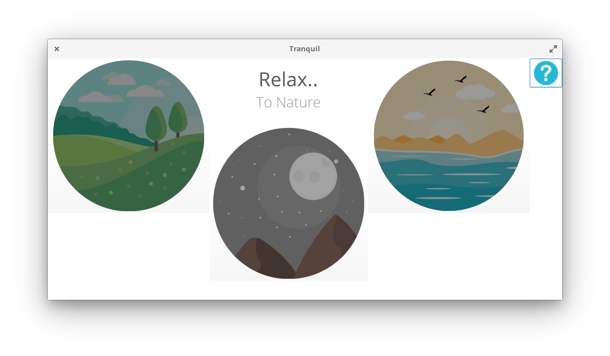

## Tranqil

Relax your mood with or concentrate on your work with 4 different soothing sounds to choose from

Simple to use, click on the images to play the sound, scroll on them to adjust the volume

## Install 

### PPA

You can install our soothing app from our PPA with the following

	sudo add-apt-repository ppa:enso-os/tranquil
	sudo apt update
	sudo apt install com.github.nick92.tranqil

### From Code

Or if you are a developer and want to build and install locally you can do with the following

#### Dependencies  

 	meson 
	libgtk-3-dev 
	libgstreamer1.0-dev
	valac

#### Build & Run

	mkdir build && meson build --prefix=/usr
	cd build
	sudo ninja install
    ./src/com.github.nick92.tranqil

## Credits

### Sounds

The sounds in version 1.1 have changed due to copyright, we have been given permission to use the great sounds produced by Grant at [NatureSoundsOfNZ](http://naturesounds.co.nz/) 

You can access his great work through the site above or via [SoundCloud](https://soundcloud.com/naturesounds_nz) 

[Rain](https://freesound.org/people/esh9419/sounds/188101) by [esh9419](https://freesound.org/people/esh9419/) Creative Commons BY 3.0

### Icons

Icons provided by: 

Forest Icon by [Freepik](http://www.freepik.com) Creative Commons BY 3.0

Sea and Night Icons by [Icon Pond]("http://www.flaticon.com/authors/popcorns-arts") Creative Commons BY 3.0

